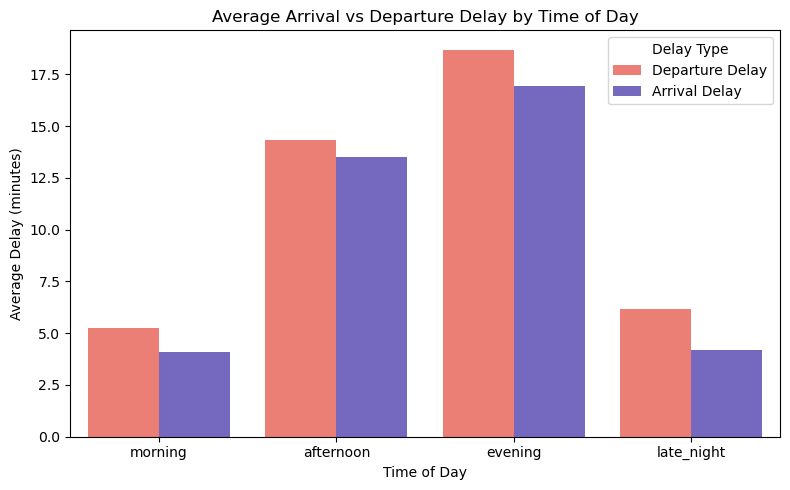
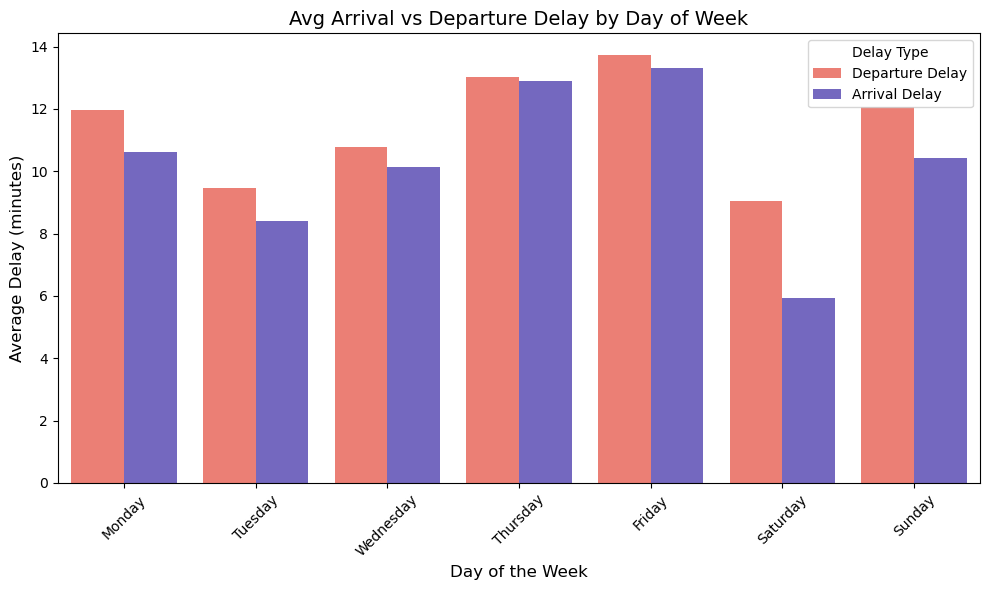
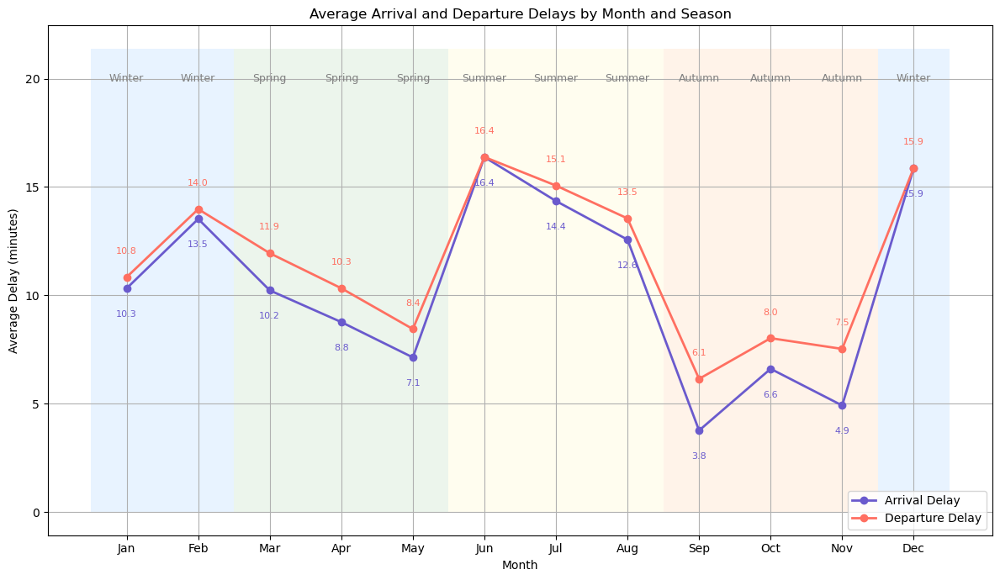
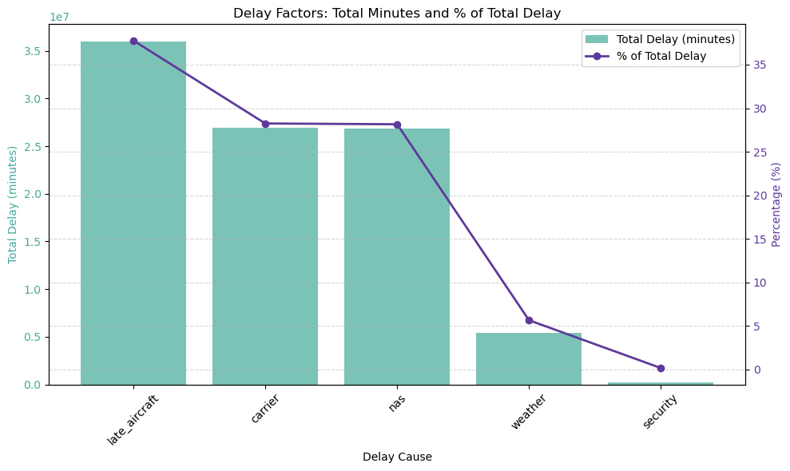
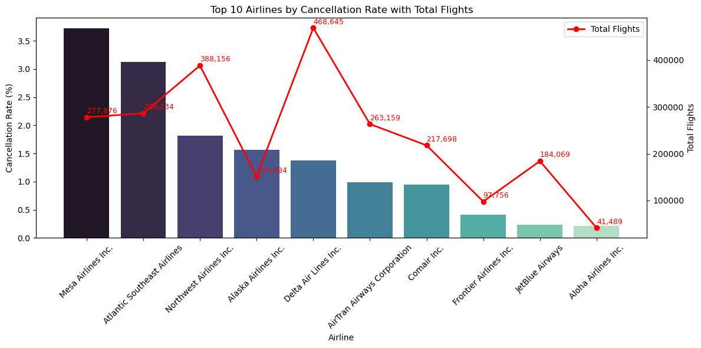
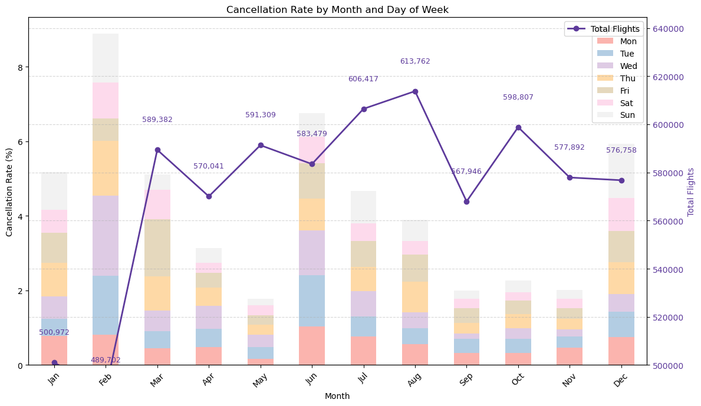

# Airline On-Time Performance Analysis (2007)

**Author:** Azrul Zulhilmi Ahmad Rosli  
**Course:** STQD6324 - Data Management (Semester 2 2024/2025)

---

## Overview

This project analyzes the 2007 U.S. Airline On-Time Performance dataset using Apache Hive on Hadoop and Python for data visualization. The goal is to uncover patterns in flight delays and cancellations, identify major contributing factors, and highlight problematic routes, airlines, and airports.

---

## Key Findings

### 1. Delay Patterns

- **Time of Day:**  
  - *Morning flights* had the lowest average delays (**Departure: 5.24 min, Arrival: 4.10 min**).
  - *Evening flights* experienced the highest delays (**Departure: 18.7 min, Arrival: 16.9 min**).

  

- **Day of Week:**  
  - *Fridays* had the highest average delays (**Arrival: 13.30 min, Departure: 13.74 min**).
  - *Tuesdays* were most punctual (**Arrival: 8.41 min, Departure: 9.48 min**).

  

- **Month/Season:**  
  - *June and December* had the highest delays (over **15 min**).
  - *May and September* had the lowest delays (**~7–8 min**).
  - *Summer* was the worst season (**Arrival: 14.43 min, Departure: 15.00 min**), while *Autumn* was the best (**Arrival: 5.10 min, Departure: 7.23 min**).

  

---

### 2. Delay Factors

- **Late aircraft delays**: **38%** of total delay minutes.
- **Carrier-related delays**: **28%**.
- **NAS (airspace/traffic control)**: **28%**.
- **Weather**: **5.7%**.
- **Security**: **<0.2%**.

  

---

### 3. Cancellations

- **Main reasons:**  
  - *Carrier issues*: **22,606 cancellations**  
  - *Weather*: **11,863**  
  - *NAS*: **7,368**  
  - *Security*: **1**

- **By airline:**  
  - *Mesa Airlines* had the highest cancellation rate (**3.72%**).
  - *JetBlue* and *Aloha Airlines* had the lowest (**0.23%** and **0.21%**).

  

- **By airport:**  
  - *Telluride Regional* had the highest origin cancellation rate (**14.81%**).
  - Smaller regional airports showed higher cancellation rates due to low flight volumes.

- **By month:**  
  - *February* had the highest cancellation rate (**1.27%**), *May* the lowest (**0.26%**).

  

---

### 4. Problematic Routes

- **Top 5 routes by cancellation rate:**
  1. **BWI–EWR (Expressjet, Flight 2491):** *30.56%* cancelled, *Avg Delay*: Arrival 31.8 min, Departure 35.2 min
  2. **AZO–ORD (Skywest, 6906):** *29.91%* cancelled, Arrival 25.7 min, Departure 18.8 min
  3. **DTW–EWR (Northwest, 656):** *26.83%* cancelled, Arrival 44.9 min, Departure 33.4 min
  4. **IAD–EWR (Expressjet, 1280):** *26.33%* cancelled, Arrival 32.9 min, Departure 38.5 min
  5. **ORF–EWR (Expressjet, 2970):** *25.70%* cancelled, Arrival 40.9 min, Departure 42.4 min

- **Main delay reasons:**  
  - *NAS (airspace congestion)* and *Late Aircraft* delays were the most frequent causes.

---

## Methodology

- **Data Processing:** Apache Hive SQL on Hadoop (via Ambari)
- **Visualization & Analysis:** Python (Pandas, Seaborn, Matplotlib)
- **Statistical Testing:** Levene’s test, Welch’s t-test for group comparisons

---

## Recommendations

- **Fly in the morning or midweek** for best on-time performance.
- **Avoid peak months** (June, December) and high-cancellation routes.
- **Airlines and airports** should focus on reducing late aircraft and carrier-related delays, and improve scheduling on problematic routes.

---

For more plots and visualizations, please see the [plots folder](./plots).

## License

This project is for academic purposes. Data source: [Kaggle - Airline On-Time Data](https://www.kaggle.com/datasets/wenxingdi/data-expo-2009-airline-on-time-data/data?select=1993.csv).

---